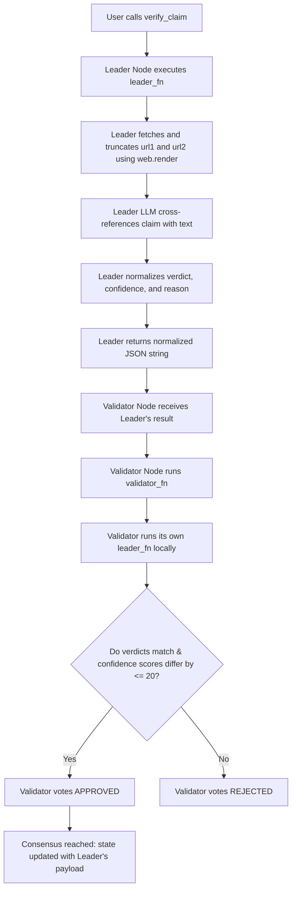

# Multi-Source Historical Fact-Checker

A decentralized compliance and verification primitive built on GenLayer (v0.2.16).

When institutions mass-produce digital curriculum materials or historical video scripts, ensuring factual accuracy is critical to prevent the dissemination of hallucinations or inaccuracies. This primitive allows users to verify a specific `historical_claim` by fetching and cross-referencing live web pages from two trusted URL sources (`url1`, `url2`) using GenLayer's built-in internet rendering capability (`gl.nondet.web.render`). A decentralized LLM jury acts as an objective fact-checking committee to evaluate the claim, returning a consensus-backed verdict: `TRUE`, `FALSE`, or `UNVERIFIABLE`.

---

## 🌟 Reusable Educational Primitive (Beyond a "One-Off Demo")

This contract serves as an automated fact-checking oracle that can be integrated across multiple institutional frameworks:
1.  **Curriculum Audit Systems:** EdTech platforms and publishing houses can plug this primitive into their publishing pipeline to automatically verify historical claims before books or modules are printed.
2.  **Decentralized Wikipedia-style Registries:** Verify student-contributed historical claims by checking them against academic citation links on-chain.
3.  **Grants & Academic Proposals:** Validate that submitted research proposals do not make historically falsified statements or incorrect geographical claims.

---

## 🏗️ Storage & State Design

The contract maintains state using GenLayer's persistent storage:
*   **`FactRecord` (Struct):** An `@allow_storage @dataclass` holding the claim, URL 1, URL 2, consensus verdict (`TRUE`, `FALSE`, or `UNVERIFIABLE`), validator confidence score (`bigint`), and qualitative cross-referencing explanation reason.
*   **`records` (TreeMap):** A persistent lookup table mapped from `str(record_id)` to `FactRecord`.
*   **`next_id` (bigint):** An auto-incrementing ID tracking the total number of verified records stored.

---

## 🤝 Custom Validator Consensus Logic

Subjective verification depends on live web retrieval and analysis. To ensure stability and resist bias, the contract uses a **Custom Validator** via `gl.vm.run_nondet_unsafe(leader_fn, validator_fn)`:



### Consensus Rules:
1.  **Normalization:** The LLM's suitability verdict is normalized into either `"TRUE"`, `"FALSE"`, or `"UNVERIFIABLE"`. The confidence score is coerced to a `0..100` integer.
2.  **Verdict Category Equality:** The validator checks if its independent run yields the **exact same verdict** (e.g., both agree it is `TRUE`).
3.  **Confidence Score Banding:** The validator checks if its confidence score is within an **absolute difference of 20 points** of the leader's score (`abs(leader_confidence - mine_confidence) <= 20`).
4.  **Reason Text Exemption:** The validator **ignores** differences in the qualitative `reason` string, preventing consensus failure due to harmless synonym variations in the generated explanation text.

---

## 🧪 Edge Case Testing Guidelines

You can test the contract using GenLayer Studio or CLI using the following scenarios:

### 1. Factual Historical Claim (TRUE Path)
*   **Claim:** "The Battle of Bach Dang River occurred in 938 AD led by Ngo Quyen."
*   **URL 1:** "https://en.wikipedia.org/wiki/Battle_of_Bach_Dang_(938)"
*   **URL 2:** "https://en.wikipedia.org/wiki/Ngo_Quyen"
*   **Expected Result:** Verdict: `TRUE`, Confidence: `~95-100`, Reason confirming that the resources support the claim.

### 2. Fabricated / Wrong Historical Claim (FALSE Path)
*   **Claim:** "The Battle of Bach Dang River occurred in 1938 AD led by Ngo Quyen."
*   **URL 1:** "https://en.wikipedia.org/wiki/Battle_of_Bach_Dang_(938)"
*   **URL 2:** "https://en.wikipedia.org/wiki/Ngo_Quyen"
*   **Expected Result:** Verdict: `FALSE`, Confidence: `~90-100`, Reason pointing out that the year was 938 AD, not 1938 AD.

### 3. Unrelated References (UNVERIFIABLE Path)
*   **Claim:** "The Battle of Bach Dang River occurred in 938 AD led by Ngo Quyen."
*   **URL 1:** "https://en.wikipedia.org/wiki/Fraction_(mathematics)"
*   **URL 2:** "https://en.wikipedia.org/wiki/Algebra"
*   **Expected Result:** Verdict: `UNVERIFIABLE`, Confidence: `~95-100`, Reason explaining that math articles contain no historical battle info.

### 4. Edge Case: Empty Fields and Invalid URLs
*   **Inputs:** `claim = ""` or URLs not starting with `http://` or `https://`
*   **Expected Result:** The contract throws a `UserError` immediately.

---

## 🌐 Deployment & Test Evidence

*   **Contract Address:** `[YOUR_DEPLOYED_CONTRACT_ADDRESS_HERE]`
*   **Network:** `studionet`

### Worked Example (Illustrative Example)

#### Example Call:
```python
contract.verify_claim(
    claim="The Battle of Bach Dang River occurred in 1938 AD.",
    url1="https://en.wikipedia.org/wiki/Battle_of_Bach_Dang_(938)",
    url2="https://en.wikipedia.org/wiki/Ngo_Quyen"
)
```

#### Expected Output (JSON from `get_record` view):
```json
{
  "id": "0",
  "claim": "The Battle of Bach Dang River occurred in 1938 AD.",
  "url1": "https://en.wikipedia.org/wiki/Battle_of_Bach_Dang_(938)",
  "url2": "https://en.wikipedia.org/wiki/Ngo_Quyen",
  "verdict": "FALSE",
  "confidence": 95,
  "reason": "The reference texts explicitly state the Battle of Bach Dang River occurred in 938 AD, directly refuting the claim's year of 1938."
}
```
*Note: The reason field is illustrative of the natural language response, while the verdict and confidence band represent the verified consensus values.*
